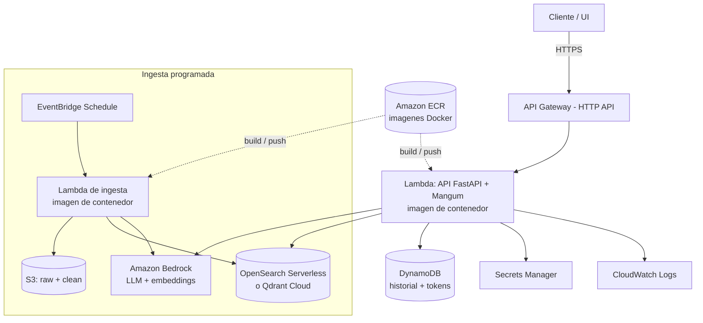

# Asistente RAG Conversacional sobre el Sitio de un Banco

Sistema **RAG (Retrieval-Augmented Generation)** que permite consultar, mediante
lenguaje natural, la información publicada en el sitio web de un banco. Scrapea
el sitio, indexa el contenido en una base vectorial y responde preguntas
apoyándose únicamente en ese contenido, con **memoria de conversación por
sesión** y **analítica del histórico**.

Todo el stack es **open source / self-hosted por defecto** y el proyecto levanta
**completamente con Docker**.

> El diseño de alto nivel (arquitectura, flujos, modelo de datos y trazabilidad
> de requisitos) está documentado en [`docs/ARCHITECTURE.md`](docs/ARCHITECTURE.md).

---

## Tabla de contenido

- [Qué hace](#qué-hace)
- [Stack tecnológico](#stack-tecnológico-y-justificación)
- [Patrones de diseño](#patrones-de-diseño)
- [Estructura del proyecto](#estructura-del-proyecto)
- [Requisitos previos](#requisitos-previos)
- [Puesta en marcha con Docker](#puesta-en-marcha-con-docker-recomendado)
- [Puesta en marcha sin Docker (modo local)](#puesta-en-marcha-sin-docker-modo-local)
- [Uso de la interfaz conversacional](#uso-de-la-interfaz-conversacional)
- [Consultar métricas (analítica)](#consultar-métricas-analítica)
- [Variables de entorno](#variables-de-entorno)
- [Endpoints de la API](#endpoints-de-la-api)
- [Limitaciones y decisiones de diseño](#limitaciones-y-decisiones-de-diseño)
- [Futuras mejoras](#futuras-mejoras)

---

## Qué hace

1. **Scraping**: recorre un subconjunto del sitio (respetando `robots.txt` y con
   rate-limit) y guarda el HTML **crudo** y el texto **limpio**.
2. **Indexación**: parte el texto en chunks con solapamiento, los vectoriza con
   embeddings multilingües y los indexa en Qdrant.
3. **Chat**: recupera los fragmentos relevantes, los reordena con un **reranker**
   (cross-encoder, opcional), arma el contexto junto con el historial reciente y
   genera una respuesta con un LLM, citando fuentes.
4. **Memoria**: persiste la conversación por `session_id` y mantiene los últimos
   **N** mensajes en contexto (N configurable).
5. **Analítica**: recorre el histórico de conversaciones y calcula métricas de
   impacto (latencia, cobertura, preguntas frecuentes, fuentes más usadas).

---

## Stack tecnológico y justificación

| Componente | Elección | Por qué |
|---|---|---|
| Lenguaje | **Python 3.11** | Requisito de la prueba. |
| Scraping | `requests` + `BeautifulSoup` + `trafilatura` | Ligero; trafilatura extrae el texto principal descartando menús/footers. |
| Embeddings | `sentence-transformers` · `multilingual-e5-small` | Gratis y self-hosted; **multilingüe** porque el contenido está en español. |
| Base vectorial | **Qdrant** (self-hosted) | Grado producción, gratis, corre como servicio propio; también soporta modo embebido en disco. |
| Reranker (opcional) | `cross-encoder` · `bge-reranker-v2-m3` | Reordena los chunks por relevancia real antes del LLM; multilingüe, activable por configuración. |
| LLM | **Ollama** (local, por defecto) · swappable a API | Cumple "herramientas gratis preferidas"; el patrón Strategy permite cambiar a OpenAI/Groq sin tocar código. |
| Memoria + métricas | **SQLite** | Cero fricción, persistente y consultable con SQL para la analítica. |
| API | **FastAPI** | Tipado, docs OpenAPI automáticas, async. |
| UI | **Streamlit** | Chat funcional y limpio con mínimo código. |
| Configuración | `pydantic-settings` + `.env` | Configuración externalizada y validada. |
| Orquestación | **Docker Compose** | Todo levanta con un comando. |

---

## Patrones de diseño

Se implementan **cuatro** patrones (la prueba pide mínimo 3), cada uno con una
razón real:

| Patrón | Dónde | Por qué |
|---|---|---|
| **Strategy** | `app/llm/base.py`, `app/embeddings/base.py`, `app/rag/reranker.py` | Proveedores de LLM, embeddings y reranker intercambiables tras una interfaz común. |
| **Factory** | `app/llm/factory.py` | Único punto de creación del LLM según la configuración. |
| **Adapter** | `app/vectorstore/qdrant_store.py` | Encapsula Qdrant tras una interfaz propia; el sistema no depende del cliente concreto. |
| **Chain of Responsibility** | `app/rag/pipeline.py` | Etapas del RAG (retrieve → rerank → prompt → generate) encadenadas; el reranker se inserta o quita como un eslabón. |

Adicionalmente se usa **Repository** (`app/memory/repository.py`) para aislar la
persistencia del historial, y un **Singleton** ligero para la configuración
(`get_settings()` cacheado).

---

## Bonus implementados

Además de los requisitos obligatorios, el proyecto incluye:

- **Reranker** (cross-encoder `bge-reranker-v2-m3`): reordena los chunks por
  relevancia real antes de pasarlos al LLM. Se activa/desactiva con
  `RERANK_ENABLED` y se inserta como un eslabón del pipeline.
- **Manejo de errores robusto en todas las capas**:
  - *Scraper*: registra las páginas fallidas y continúa; reintentos ante fallos
    transitorios.
  - *LLM*: mensajes accionables (modelo no descargado, servicio caído).
  - *Ingesta*: si un lote de embeddings falla, lo omite y continúa; reporta
    cuántos chunks no se indexaron.
  - *API*: validación de entrada, handler global de excepciones y códigos HTTP
    semánticos (`400` entrada inválida, `503` infraestructura caída, `500`
    fallo controlado).
- **Configuración externalizada** completa vía `.env` (N mensajes, modelo,
  tamaño de chunk, top_k, reranker, etc.).

---

## Estructura del proyecto

```
.
├── app/
│   ├── config.py                # configuración centralizada (pydantic-settings)
│   ├── scraper/                 # crawler + cleaner (raw + clean)
│   ├── ingestion/               # chunker + indexer
│   ├── embeddings/              # interfaz + sentence-transformers
│   ├── llm/                     # Strategy + Factory (Ollama / OpenAI)
│   ├── vectorstore/             # adapter de Qdrant
│   ├── rag/                     # pipeline + reranker (Chain of Responsibility)
│   ├── memory/                  # Repository sobre SQLite
│   ├── analytics/               # métricas del histórico
│   ├── api/                     # FastAPI (/chat, /sessions, /metrics)
│   └── ui/                      # chat en Streamlit
├── docs/ARCHITECTURE.md         # diseño de alto nivel
├── data/                        # raw/ y clean/ (generado, no versionado)
├── diagnose.py                  # diagnóstico de accesibilidad del sitio
├── Dockerfile
├── docker-compose.yml
├── Makefile
├── requirements.txt
└── .env.example
```

---

## Requisitos previos

- **Docker** y **Docker Compose** (para el modo recomendado).
- Alternativamente, **Python 3.11+** para el modo local sin Docker.
- Al menos ~8 GB de RAM libres si se usa Ollama con un modelo local.
- (Opcional) Una API key si se usa un LLM por API en lugar de Ollama.

---

## Puesta en marcha con Docker (recomendado)

### 1. Clonar y configurar

```bash
git clone <URL-del-repo>
cd <carpeta-del-repo>
cp .env.example .env        # en Windows PowerShell: Copy-Item .env.example .env
```

Revisa el `.env` y ajusta la fuente de scraping y el LLM si hace falta
(ver [Variables de entorno](#variables-de-entorno) y
[Limitaciones](#limitaciones-y-decisiones-de-diseño)).

### 2. Levantar todo con un comando

**Linux / macOS / Codespaces** (con `make`):

```bash
make setup     # up + pull-model + scrape + ingest
```

**Windows** (o sin `make`), los mismos pasos de forma explícita:

```bash
docker compose up -d --build
docker compose exec ollama ollama pull qwen2.5:0.5b
docker compose run --rm api python -m app.scraper.run
docker compose run --rm api python -m app.ingestion.run
```

### 3. Abrir el sistema

- **Interfaz de chat**: http://localhost:8501
- **API (documentación)**: http://localhost:8000/docs

> La primera vez tarda: descarga imágenes, el modelo de Ollama y el de
> embeddings. Es normal.

---

## Puesta en marcha sin Docker (modo local)

Útil en equipos donde no se puede instalar Docker. Usa Qdrant **embebido en
disco** y un LLM por API (no requiere instalar nada extra más allá de pip).

En el `.env`:

```
QDRANT_URL=local:./data/qdrant_local
LLM_PROVIDER=openai
OPENAI_API_KEY=tu-key
OPENAI_BASE_URL=https://api.groq.com/openai/v1   # ejemplo con Groq (gratis)
LLM_MODEL=llama-3.1-8b-instant
API_URL=http://localhost:8000
```

Luego:

```bash
pip install -r requirements.txt
python -m app.scraper.run
python -m app.ingestion.run          # escribe en ./data/qdrant_local y termina
uvicorn app.api.main:app --port 8000 # terminal 1
streamlit run app/ui/streamlit_app.py # terminal 2
```

> El modo embebido de Qdrant es de un proceso a la vez: ejecuta la ingesta
> **antes** de levantar la API.

---

## Uso de la interfaz conversacional

1. Abre la UI (puerto 8501).
2. Escribe una pregunta sobre el contenido scrapeado. El asistente responde
   citando las **fuentes** utilizadas.
3. La conversación se mantiene por sesión: el sistema recuerda los últimos **N**
   mensajes (configurable con `CONVERSATION_WINDOW`).
4. El botón **"Nueva conversación"** inicia una sesión nueva.

También puedes usar la API directamente:

```bash
curl -X POST http://localhost:8000/chat \
  -H "Content-Type: application/json" \
  -d '{"session_id":"demo","message":"¿Qué productos ofrece el banco?"}'
```

---

## Consultar métricas (analítica)

El sistema recorre el histórico de conversaciones (en SQLite) y calcula métricas
de impacto: número de sesiones y mensajes, promedio por sesión, latencia
p50/p95, **consumo de tokens** (total y promedio por respuesta), **tasa de
respuestas sin contexto**, preguntas más frecuentes y fuentes más usadas.

```bash
# Reporte legible por CLI
docker compose exec api python -m app.analytics.run

# Salida JSON
docker compose exec api python -m app.analytics.run --json

# Por API
curl http://localhost:8000/metrics
```

> Las métricas se calculan sobre el histórico real, así que primero hay que
> haber chateado algunas preguntas.

---

## Variables de entorno

Configuradas en `.env` (ver `.env.example` para la lista completa):

| Variable | Descripción | Ejemplo |
|---|---|---|
| `LLM_PROVIDER` | `ollama` u `openai` | `ollama` |
| `LLM_MODEL` | Modelo del LLM | `qwen2.5:0.5b` |
| `OLLAMA_BASE_URL` | URL de Ollama | `http://ollama:11434` |
| `OPENAI_API_KEY` / `OPENAI_BASE_URL` | Credenciales si se usa API | — |
| `EMBEDDING_MODEL` | Modelo de embeddings | `intfloat/multilingual-e5-small` |
| `QDRANT_URL` | Servidor o modo embebido | `http://qdrant:6333` |
| `CHUNK_SIZE` / `CHUNK_OVERLAP` | Tamaño y solapamiento de chunks | `800` / `120` |
| `TOP_K` | Chunks recuperados por consulta | `5` |
| `RERANK_ENABLED` | Activa el reranker cross-encoder | `true` |
| `RERANKER_MODEL` | Modelo del reranker | `BAAI/bge-reranker-v2-m3` |
| `RERANK_TOP_N` | Chunks que pasan al LLM tras el rerank | `3` |
| `CONVERSATION_WINDOW` | N mensajes de contexto | `6` |
| `SCRAPE_BASE_URL` | Sitio a scrapear | `https://...` |
| `SCRAPE_MAX_PAGES` | Tope de páginas | `40` |

---

## Endpoints de la API

| Método | Ruta | Descripción |
|---|---|---|
| `GET` | `/health` | Estado del sistema y configuración activa. |
| `POST` | `/chat` | Envía una pregunta; devuelve respuesta + fuentes + latencia. |
| `GET` | `/sessions` | Lista las sesiones registradas. |
| `GET` | `/sessions/{id}` | Mensajes de una sesión. |
| `GET` | `/metrics` | Métricas del histórico de conversaciones. |

Documentación interactiva en `/docs`.

---

## Escalabilidad en la nube (AWS)

El diseño desacoplado (patrones **Strategy, Repository, Adapter, Factory**) hace
que llevar el sistema a una arquitectura **serverless** en AWS sea, en su mayoría,
reimplementar interfaces existentes — sin reescribir la lógica de negocio.

### Arquitectura propuesta



### Cómo escala cada componente

- **Empaquetado — Amazon ECR**: la **misma imagen** del `Dockerfile` se publica
  en ECR y alimenta las funciones Lambda basadas en contenedor.
- **API — AWS Lambda + API Gateway**: la app FastAPI se envuelve con `Mangum`
  para correr en Lambda; **API Gateway** (HTTP API) enruta `/chat`, `/sessions` y
  `/metrics`. Escala automáticamente por petición, sin servidores que administrar.
- **LLM y embeddings — Amazon Bedrock**: se añade un `BedrockProvider` (Strategy)
  y un embedder de Bedrock/Titan. Evita cargar modelos pesados en la Lambda y
  elimina el cold start de torch.
- **Base vectorial**: Amazon OpenSearch Serverless (con soporte vectorial) o
  Qdrant Cloud, detrás del mismo **Adapter**.
- **Memoria — DynamoDB**: un `DynamoDBRepository` (mismo contrato **Repository**)
  para historial y tokens; serverless y con escalado automático.
- **Ingesta — EventBridge + Lambda / Fargate**: un *schedule* dispara la ingesta
  periódica; el HTML crudo y limpio se guarda en **S3**. Para sitios grandes,
  ECS Fargate o AWS Batch evitan el límite de 15 min de Lambda.
- **Secretos — Secrets Manager**: API keys y credenciales.
- **UI**: Streamlit se despliega en **ECS Fargate** o **App Runner** (no encaja en
  Lambda por ser un proceso persistente); alternativamente, un front estático en
  **S3 + CloudFront** que consume API Gateway.
- **Observabilidad — CloudWatch**: logs y métricas.

### Flujo de despliegue (resumen)

```bash
# 1. Publicar la imagen en ECR
aws ecr create-repository --repository-name rag-assistant
docker build -t rag-assistant .
ACCT=<account-id>; REGION=<region>
docker tag rag-assistant:latest $ACCT.dkr.ecr.$REGION.amazonaws.com/rag-assistant:latest
aws ecr get-login-password --region $REGION | \
  docker login --username AWS --password-stdin $ACCT.dkr.ecr.$REGION.amazonaws.com
docker push $ACCT.dkr.ecr.$REGION.amazonaws.com/rag-assistant:latest

# 2. Crear la Lambda desde la imagen y conectarla a API Gateway (HTTP API).
#    Recomendado vía IaC: Terraform, AWS SAM o CDK.
```

### Por qué la migración es de bajo esfuerzo

Cada servicio gestionado de AWS entra por una **interfaz que ya existe** en el
código; el pipeline RAG y la API **no cambian**:

| Local | AWS gestionado | Interfaz a implementar |
|---|---|---|
| Ollama / API | Amazon Bedrock | `LLMProvider` (Strategy) |
| sentence-transformers | Bedrock Titan | `Embedder` (Strategy) |
| Qdrant | OpenSearch Serverless / Qdrant Cloud | `QdrantStore` (Adapter) |
| SQLite | DynamoDB | `ConversationRepository` (Repository) |

> Para el empaquetado en Lambda se añadiría `mangum` a `requirements.txt` y un
> handler que envuelva la app FastAPI (`handler = Mangum(app)`).

---

## Limitaciones y decisiones de diseño

- **El sitio de BBVA (`bbva.com.co`) responde 403** a peticiones programáticas por
  un WAF anti-bot (verificable con `python diagnose.py`). Como la prueba permite
  otra fuente, `SCRAPE_BASE_URL` se configura hacia un sitio accesible con
  contenido equivalente. **El pipeline es agnóstico a la fuente**: basta cambiar
  esa variable.
- **Modelo LLM liviano por defecto** (`qwen2.5:0.5b`) para que arranque en
  cualquier equipo. Para mejor calidad de respuesta, usar `qwen2.5:3b` o superior
  si hay recursos. El trade-off es calidad vs. peso.
- **Modo de desarrollo sin Docker**: por restricciones de equipo, el desarrollo
  puede hacerse con Qdrant embebido y LLM por API. La **configuración dockerizada
  por defecto usa Ollama (gratis)**, tal como pide la prueba.
- **SQLite** es suficiente para un solo nodo; para alta concurrencia se migraría a
  Postgres (aislado tras el patrón Repository, sin cambios en la lógica).
- Embeddings y LLM corren en CPU: la latencia depende del hardware.

---

## Futuras mejoras

- **Gating por umbral**: responder "sin información" sin invocar al LLM cuando
  ningún chunk supera un umbral de relevancia.
- **Condensación de la pregunta**: reescribir preguntas de seguimiento como
  consultas autónomas para mejorar la recuperación.
- **Observabilidad** (trazas por consulta con OpenTelemetry).
- **Suite de tests unitarios** y CI (GitHub Actions).
- Scraping con navegador headless (Playwright) para sitios con mucho JavaScript.